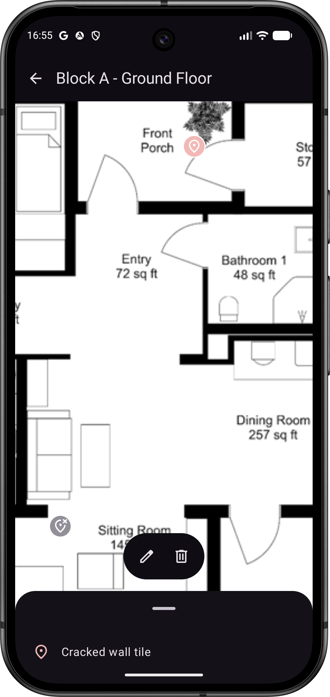
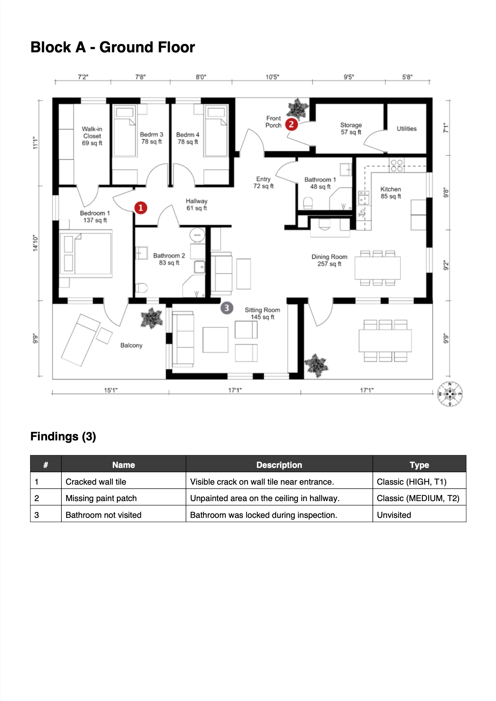
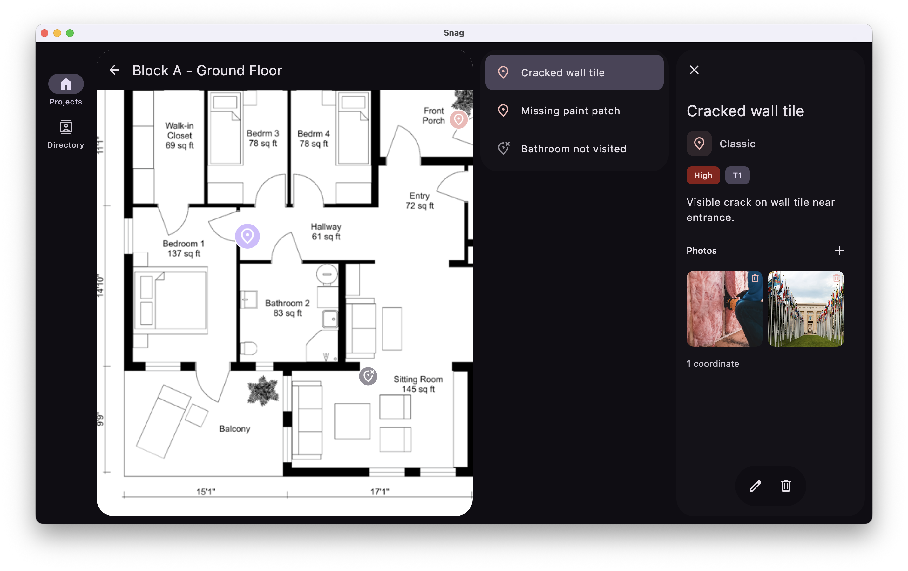
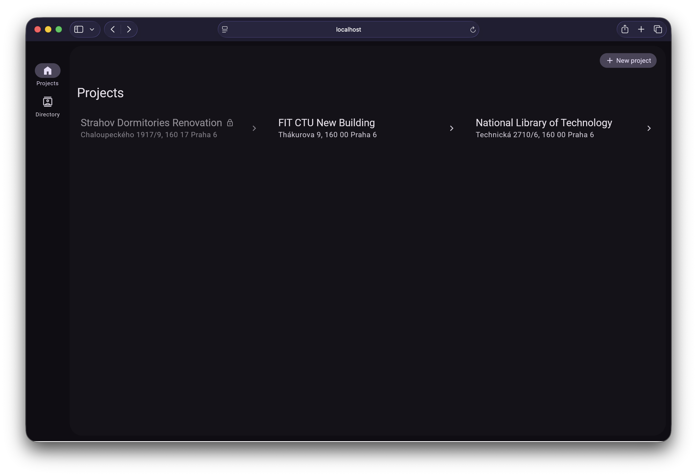

This is a Kotlin Multiplatform project targeting Android, iOS, Web, Desktop (JVM), Server.

# Screenshots

<table>
  <tr>
    <td align="center" width="50%">
      <br>
      <sub>Interactive floor plan with finding pins (Android)</sub>
    </td>
    <td align="center" width="50%">
      <br>
      <sub>Generated PDF report page</sub>
    </td>
  </tr>
  <tr>
    <td align="center">
      <br>
      <sub>Adaptive multi-pane layout on desktop</sub>
    </td>
    <td align="center">
      <br>
      <sub>Project list in the web app</sub>
    </td>
  </tr>
</table>

# Prerequisites

## Google Cloud Storage Setup

This project uses Google Cloud Storage for file storage. Follow these steps to set up your development environment:

### 1. Install Google Cloud CLI

- **macOS** (using Homebrew):
```shell
  brew install --cask google-cloud-sdk
```
- **Windows/Linux**: Download from [https://cloud.google.com/sdk/docs/install](https://cloud.google.com/sdk/docs/install)

### 2. Authenticate with Google Cloud

Initialize the gcloud CLI and authenticate:
```shell
gcloud init
```
Follow the prompts to:
- Sign in with your Google account (you have to be added to the GCP project)
- Select the `snag-487319` project

### 3. Set Up Application Default Credentials

Configure credentials for the application code:
```shell
gcloud auth application-default login
```

This creates credentials at `~/.config/gcloud/application_default_credentials.json` that the application will use automatically.

**Important**: Never commit credential files to the repository. They contain sensitive authentication tokens.

### 4. Verify Setup

You can verify your setup by listing the project's buckets:
```shell
gsutil ls
```

# Building and Running the Project

## Build and Run Android Application

To build and run the development version of the Android app, use the run configuration from the run widget
in your IDE’s toolbar or build it directly from the terminal:
- on macOS/Linux
  ```shell
  ./gradlew :androidApp:assembleDebug
  ```
- on Windows
  ```shell
  .\gradlew.bat :androidApp:assembleDebug
  ```

## Build and Run Desktop (JVM) Application

To build and run the development version of the desktop app, use the run configuration from the run widget
in your IDE’s toolbar or run it directly from the terminal:
- on macOS/Linux
  ```shell
  ./gradlew :composeApp:run
  ```
- on Windows
  ```shell
  .\gradlew.bat :composeApp:run
  ```

## Build and Run Server

To build and run the development version of the server, use the run configuration from the run widget
in your IDE’s toolbar or run it directly from the terminal:
- on macOS/Linux
  ```shell
  ./gradlew :server:run --no-daemon
  ```
- on Windows
  ```shell
  .\gradlew.bat :server:run --no-daemon
  ```

## Build and Run Web Application

To build and run the development version of the web app, use the run configuration from the run widget
in your IDE's toolbar or run it directly from the terminal:
- for the Wasm target (faster, modern browsers):
  - on macOS/Linux
    ```shell
    ./gradlew :composeApp:wasmJsBrowserDevelopmentRun
    ```
  - on Windows
    ```shell
    .\gradlew.bat :composeApp:wasmJsBrowserDevelopmentRun
    ```
- for the JS target (slower, supports older browsers):
  - on macOS/Linux
    ```shell
    ./gradlew :composeApp:jsBrowserDevelopmentRun
    ```
  - on Windows
    ```shell
    .\gradlew.bat :composeApp:jsBrowserDevelopmentRun
    ```

## Build and Run iOS Application

To build and run the development version of the iOS app, use the run configuration from the run widget
in your IDE’s toolbar or open the [/iosApp](./iosApp) directory in Xcode and run it from there.

# Server Target

By default, frontend clients connect to `localhost`. To target a Cloud Run deployment instead, set the `snag.serverTarget` property in `gradle.properties`:

```properties
snag.serverTarget=dev
```

Valid values: `localhost` (default), `dev`, `demo`.

After changing the value, re-sync the Gradle project in your IDE. This applies to all build targets (Android, desktop, web).

Alternatively, you can pass it as a command-line flag without modifying any files:
```shell
./gradlew <task> -Psnag.serverTarget=dev
```

# Making a Release

1. Tag and push:
   ```bash
   git tag v0.2.0
   git push origin v0.2.0
   ```
2. GitHub Actions automatically builds all platform artifacts and creates a GitHub Release with them attached
3. Artifacts are downloadable from the [Releases](../../releases) page

The version is derived entirely from the git tag — no manual version bumps needed anywhere.

# Project Structure

See [Project Structure](docs/project_structure.md).


# Affiliation

This software was developed with the support of the **Faculty of Information Technology, Czech Technical University in Prague**.
For more information, visit [fit.cvut.cz](https://fit.cvut.cz).
